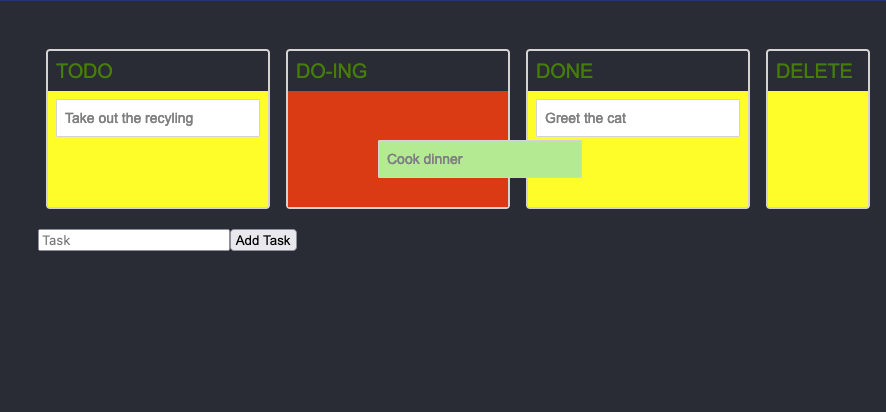

## `tutorial_react-beautiful-dnd`

This is a **react-beautiful-dnd** page started by following the tutorial at [https://egghead.io/](https://egghead.io/lessons/react-course-introduction-beautiful-and-accessible-drag-and-drop-with-react-beautiful-dnd)

Then to learn to add items I used [this tutorial from Krissanawat Kaewsanmuang](https://medium.com/js-geek/create-a-simple-todo-app-in-react-72d9341a7e6c).

I then made a break through using [w3school react forms demo](https://www.w3schools.com/react/showreact.asp?filename=demo2_react_forms_submit) to understand how to edit/append the state.

Probably need to check out [object constructors](https://www.w3schools.com/js/js_object_constructors.asp) or something next.

**I have listed the steps taken to get the page to here in [TUTORIAL.md](/TUTORIAL.md)**

Check out the following GitHub repos and pages for more info about components used in making this react-webpage:
* [react](https://github.com/facebook/react) the javascript library, and [create-react-app](https://github.com/facebook/create-react-app) the github repo used to bootstrap this app
* [react-beautiful-dnd](https://github.com/atlassian/react-beautiful-dnd) where I found the tutorial for drag and drop
* [yarn](https://github.com/yarnpkg/yarn) a dependency manager

  * [styled-components](https://github.com/styled-components/styled-components)
  * [@atlaskit/css-reset](https://atlaskit.atlassian.com/packages/css-packs/css-reset)

-----

This project was bootstrapped with [Create React App](https://github.com/facebook/create-react-app).

*  ### Available Scripts

   In the project directory, you can run:

   > ### `yarn start`

   Runs the app in the development mode. 
   Open [http://localhost:3000](http://localhost:3000) to view it in the browser.

   The page will reload if you make edits. 
   You will also see any lint errors in the console.

...
